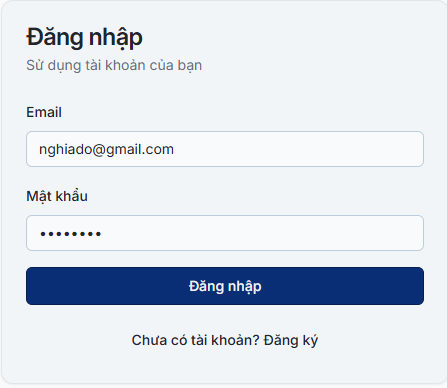
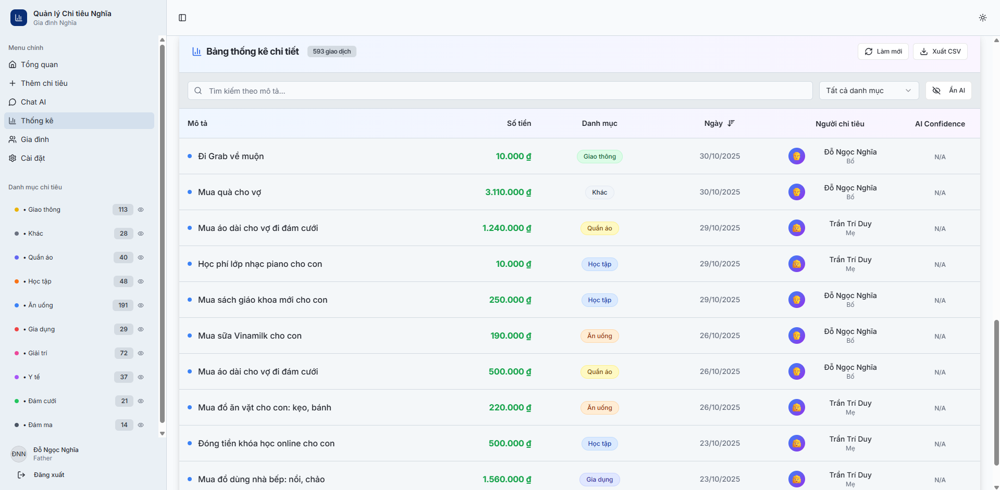
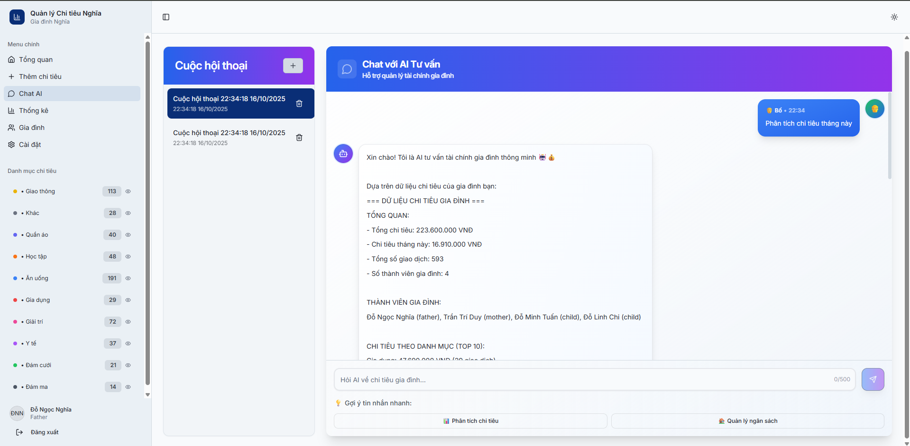
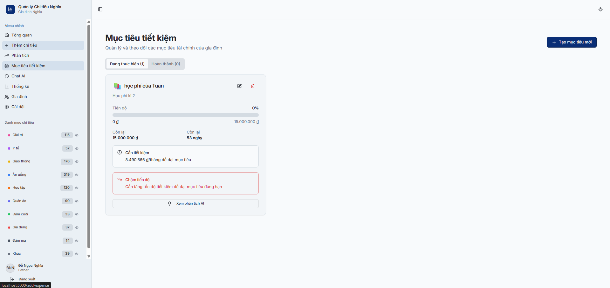
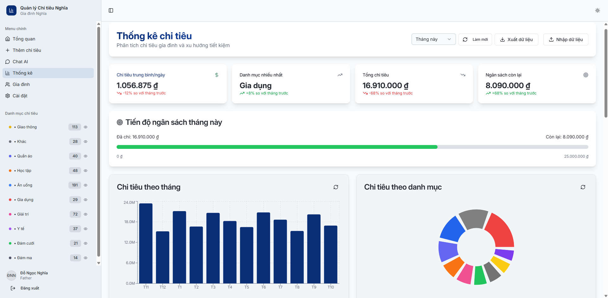
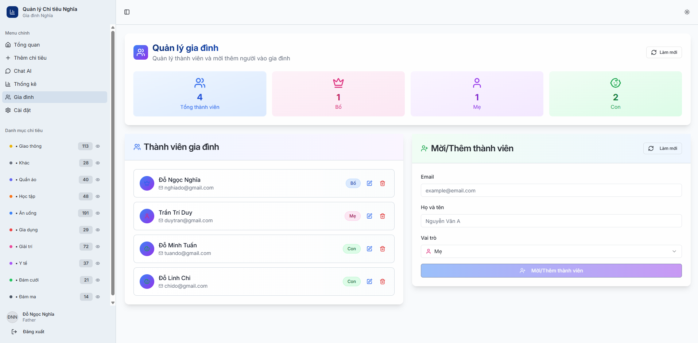
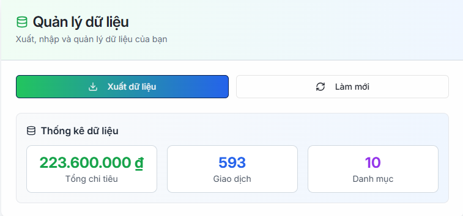

<h2 align="center">
    <a href="https://dainam.edu.vn/vi/khoa-cong-nghe-thong-tin">
    🎓 Faculty of Information Technology (DaiNam University)
    </a>
</h2>
<h2 align="center">
   ỨNG DỤNG CHUYỂN ĐỔI SỐ TRONG VIỆC QUẢN LÝ CHI TIÊU CHO GIA ĐÌNH 
</h2>

<div align="center">
    <p align="center">
        
        
        
    </p>

[](https://www.facebook.com/DNUAIoTLab)
[](https://dainam.edu.vn/vi/khoa-cong-nghe-thong-tin)
[](https://dainam.edu.vn)

</div>

---

## 📑 Mục lục

- [1. Giới thiệu Đề tài](#1--giới-thiệu-đề-tài)
  - [Mục tiêu của dự án](#-mục-tiêu-của-dự-án)
  - [Kiến trúc hệ thống](#-kiến-trúc-hệ-thống)
  - [Tính năng nổi bật](#-tính-năng-nổi-bật)
- [2. Công nghệ sử dụng](#2--công-nghệ-sử-dụng)
- [3. Hình ảnh Demo](#3--hình-ảnh-demo)
  - [Đăng nhập](#-đăng-nhập-hệ-thống)
  - [Dashboard Tổng quan](#-dashboard-tổng-quan)
  - [Thêm Chi tiêu](#-thêm-chi-tiêu)
  - [Chat AI Tư vấn](#-chat-ai-tư-vấn)
  - [Mục tiêu Tiết kiệm](#-mục-tiêu-tiết-kiệm)
  - [Phân tích Chi tiêu](#-phân-tích-chi-tiêu)
  - [Thống kê và Báo cáo](#-thống-kê-và-báo-cáo)
  - [Quản lý Gia đình](#-quản-lý-gia-đình)
  - [Cài đặt và Xuất dữ liệu](#-cài-đặt-và-xuất-dữ-liệu)
- [4. Cài đặt và Chạy](#4--cài-đặt-và-chạy)
- [5. Thông tin Phát triển](#5--thông-tin-phát-triển)

---

## 1. 📖 Giới thiệu Đề tài

**FinanceFlow** là một hệ thống quản lý chi tiêu gia đình thông minh được phát triển trong khuôn khổ môn học **Chuyển đổi số**, áp dụng các công nghệ hiện đại nhất để giải quyết bài toán quản lý tài chính cá nhân và gia đình. Hệ thống được xây dựng trên nền tảng **React + Node.js** với kiến trúc Full-Stack, tích hợp trí tuệ nhân tạo để mang lại trải nghiệm quản lý tài chính thông minh và tiện lợi.

### 🎯 **Mục tiêu của dự án:**

Trong bối cảnh chuyển đổi số mạnh mẽ hiện nay, việc quản lý tài chính cá nhân và gia đình đang trở thành một nhu cầu cấp thiết. FinanceFlow ra đời nhằm:

- **Số hóa quy trình quản lý chi tiêu** truyền thống, thay thế sổ sách ghi chép bằng công nghệ hiện đại
- **Tự động hóa phân loại chi tiêu** thông qua AI, giảm thiểu công việc thủ công
- **Tối ưu hóa ngân sách gia đình** với các gợi ý thông minh từ AI
- **Tăng cường tính minh bạch** trong quản lý tài chính giữa các thành viên gia đình
- **Nâng cao nhận thức tài chính** thông qua các báo cáo và phân tích trực quan

### 🏗️ **Kiến trúc hệ thống:**

FinanceFlow được thiết kế theo mô hình **Microservices** với các thành phần chính:

- **Frontend (React + TypeScript)**: Giao diện người dùng hiện đại, responsive trên mọi thiết bị
- **Backend (Node.js + Express)**: API server xử lý logic nghiệp vụ và tích hợp AI
- **Database (PostgreSQL)**: Lưu trữ dữ liệu chính với tính toàn vẹn cao
- **AI Engine (Google Gemini)**: Xử lý phân loại chi tiêu và tư vấn tài chính
- **Logging System (MongoDB)**: Ghi log hệ thống và phân tích hành vi người dùng

### ⚡ **Tính năng nổi bật:**

#### 🤖 **Trí tuệ nhân tạo thông minh**
- **Phân loại tự động**: AI tự động phân loại chi tiêu vào 10+ danh mục (Ăn uống, Giao thông, Học tập, Y tế, Giải trí, v.v.)
- **Tư vấn tài chính**: Chat AI đưa ra lời khuyên cá nhân hóa dựa trên lịch sử chi tiêu
- **Dự báo xu hướng**: Phân tích và dự đoán chi tiêu trong tương lai
- **Gợi ý tiết kiệm**: Đề xuất các cách tiết kiệm hiệu quả dựa trên thói quen chi tiêu

#### 👨‍👩‍👧‍👦 **Quản lý gia đình toàn diện**
- **Hệ thống vai trò**: Phân quyền rõ ràng cho từng thành viên (Bố, Mẹ, Con)
- **Ngân sách cá nhân**: Mỗi thành viên có ngân sách riêng và tổng ngân sách gia đình
- **Theo dõi chi tiêu**: Xem chi tiêu của từng thành viên và tổng hợp
- **Mời thành viên**: Dễ dàng thêm thành viên mới vào gia đình

#### 📊 **Dashboard và báo cáo trực quan**
- **Thống kê real-time**: Cập nhật dữ liệu theo thời gian thực
- **Biểu đồ tương tác**: Hiển thị chi tiêu theo danh mục, tháng, năm
- **Báo cáo xu hướng**: Phân tích xu hướng chi tiêu và tiết kiệm
- **So sánh ngân sách**: Đối chiếu chi tiêu thực tế với ngân sách đã đặt
- **Phân tích đa chiều**: Chi tiêu theo ngày, tuần, tháng với biểu đồ trực quan
- **Dự báo AI**: Dự đoán chi tiêu tương lai dựa trên lịch sử

#### 💎 **Quản lý mục tiêu tiết kiệm**
- **Theo dõi tiến độ**: Hiển thị tiến độ tiết kiệm theo thời gian thực
- **Cảnh báo thông minh**: Tự động cảnh báo khi chậm tiến độ
- **Tính toán tự động**: Tính số tiền cần tiết kiệm mỗi tháng để đạt mục tiêu
- **Phân tích AI**: Gợi ý cách đạt mục tiêu đúng hạn
- **Quản lý đa mục tiêu**: Hỗ trợ nhiều mục tiêu đồng thời

#### 💬 **Chat AI tư vấn tài chính**
- **Giao tiếp tự nhiên**: Chat bằng tiếng Việt với AI
- **Tư vấn cá nhân hóa**: Lời khuyên dựa trên tình hình tài chính cụ thể
- **Phân tích chi tiêu**: AI giải thích các xu hướng chi tiêu
- **Lập kế hoạch tài chính**: Hỗ trợ lập kế hoạch ngân sách dài hạn

#### 🔄 **Đồng bộ và tích hợp**
- **Real-time sync**: Cập nhật dữ liệu ngay lập tức giữa các thiết bị
- **Multi-device**: Hoạt động mượt mà trên desktop, tablet, mobile
- **Offline support**: Lưu trữ tạm thời khi mất kết nối
- **Data export**: Xuất dữ liệu ra Excel, PDF để lưu trữ

#### 🔐 **Bảo mật và riêng tư**
- **JWT Authentication**: Xác thực an toàn với token
- **Mã hóa dữ liệu**: Mã hóa mật khẩu và thông tin nhạy cảm
- **Phân quyền chi tiết**: Kiểm soát quyền truy cập từng chức năng
- **Backup tự động**: Sao lưu dữ liệu định kỳ

### 🔑 Tài khoản mặc định:
- **Bố**: `nghiado@gmail.com` / `Nghia123`
- **Mẹ**: `duytran@gmail.com` / `Duy123`

---

## 2. 🛠️ Công nghệ sử dụng

| Công nghệ                      | Phiên bản    | Mục đích sử dụng                          |
|--------------------------------|--------------|-------------------------------------------|
| **React**                      | 18.3.1       | Frontend framework chính                  |
| **TypeScript**                 | 5.6.3        | Ngôn ngữ lập trình type-safe              |
| **Node.js**                    | 20.16.11     | Runtime môi trường backend               |
| **Express.js**                 | 4.21.2       | Web framework cho API server             |
| **PostgreSQL**                 | 16           | Cơ sở dữ liệu chính (quan hệ)            |
| **MongoDB**                    | 7.0          | Cơ sở dữ liệu NoSQL cho logging          |
| **Drizzle ORM**                | 0.39.1       | Object-Relational Mapping                 |
| **Google Gemini AI**           | 1.20.0       | AI phân loại chi tiêu và tư vấn tài chính |
| **Tailwind CSS**               | 3.4.17       | CSS framework cho styling                |
| **Radix UI**                   | Latest       | Component library hiện đại               |
| **Vite**                       | 5.4.19       | Build tool và dev server                 |
| **Docker**                     | Latest       | Containerization và deployment           |

### 🗂️ Cấu trúc Database (PostgreSQL Tables):
- **`users`** - Thông tin thành viên gia đình (email, role, familyId...)
- **`expenses`** - Chi tiêu của gia đình (description, amount, category...)
- **`chat_sessions`** - Phiên chat với AI tư vấn tài chính
- **`chat_messages`** - Tin nhắn trong các phiên chat
- **`savings_goals`** - Mục tiêu tiết kiệm của gia đình
- **`budget_alerts`** - Cảnh báo ngân sách và chi tiêu

---

## 3. 📸 Hình ảnh Demo

> **Lưu ý**: Tất cả ảnh demo được lưu trữ tại thư mục `./projects/anhduan/`

---

## 🔐 ĐĂNG NHẬP HỆ THỐNG

### 🚪 Giao diện Đăng nhập

<div align="center">
  
  <p><em>Giao diện đăng nhập với validation và bảo mật cao</em></p>
</div>

---

## 🏠 DASHBOARD TỔNG QUAN

### 🎯 Trang chủ Dashboard

<div align="center">
  
  <p><em>Dashboard chính với giao diện quản lý chi tiêu gia đình thông minh, AI insights và thống kê trực quan</em></p>
</div>

---

## 💰 THÊM CHI TIÊU

### 📝 Form Thêm Chi tiêu

<div align="center">
  
  <p><em>Form thêm chi tiêu với AI phân loại tự động và validation thông minh</em></p>
</div>

---

## 🤖 CHAT AI TƯ VẤN

### 💬 Giao diện Chat

<div align="center">
  
  <p><em>Chat với AI tư vấn tài chính thông minh, hỗ trợ quản lý ngân sách gia đình</em></p>
</div>

---

## 💎 MỤC TIÊU TIẾT KIỆM

### 🎯 Quản lý Mục tiêu Tài chính

<div align="center">
  
  <p><em>Giao diện quản lý mục tiêu tiết kiệm với theo dõi tiến độ, cảnh báo chậm tiến độ và phân tích AI</em></p>
</div>

---

## 📊 PHÂN TÍCH CHI TIÊU

### 📈 Dashboard Phân tích Chi tiết

<div align="center">
  
  <p><em>Dashboard phân tích chi tiêu với biểu đồ theo ngày, tuần, tháng và dự báo AI</em></p>
</div>

---

## 📊 THỐNG KÊ VÀ BÁO CÁO

### 📈 Thống kê Tổng hợp

<div align="center">
  
  <p><em>Biểu đồ chi tiêu theo danh mục và xu hướng tháng với AI phân tích</em></p>
</div>

---

## 👨‍👩‍👧‍👦 QUẢN LÝ GIA ĐÌNH

### 🏠 Quản lý Thành viên Gia đình

<div align="center">
  
  <p><em>Quản lý thành viên gia đình với vai trò bố, mẹ, con và ngân sách cá nhân</em></p>
</div>

---

## ⚙️ CÀI ĐẶT VÀ XUẤT DỮ LIỆU

### 🔧 Trang Cài đặt

<div align="center">
  
  <p><em>Giao diện cài đặt hệ thống và cấu hình người dùng</em></p>
</div>

### 📤 Xuất Dữ liệu

<div align="center">
  
  <p><em>Chức năng xuất dữ liệu chi tiêu ra Excel, PDF để lưu trữ và báo cáo</em></p>
</div>


---

## 4. ⚙️ Cài đặt và Chạy

### 📋 Yêu cầu hệ thống
- **Node.js 18+** (khuyến nghị 20.16.11)
- **PostgreSQL 16+** chạy trên `localhost:5432`
- **MongoDB 7.0+** chạy trên `localhost:27017`
- **Docker & Docker Compose** (tùy chọn)
- **RAM**: khuyến nghị 8GB
- **Dung lượng**: ~500MB cho ứng dụng và dependencies

### 🚀 Hướng dẫn cài đặt và chạy 

**Bước 1: Chuẩn bị môi trường**
```bash
# Kiểm tra Node.js version
node --version

# Kiểm tra npm version
npm --version

# Kiểm tra PostgreSQL đang chạy
psql -U postgres -c "SELECT version();"

# Kiểm tra MongoDB đang chạy
mongosh --eval "db.adminCommand('hello')"
```

**Bước 2: Clone và cài đặt project**
```bash
# Di chuyển đến thư mục dự án
cd FinanceFlow

# Cài đặt dependencies
npm install

# Tạo file .env từ template
cp .env.example .env
```

**Bước 3: Cấu hình môi trường**
```bash
# Tạo file .env và cấu hình các biến môi trường
# Cần cấu hình:
# - DATABASE_URL (PostgreSQL)
# - MONGODB_URI (MongoDB)
# - GEMINI_API_KEY (Google Gemini AI)
# - JWT_SECRET (Bảo mật)
```

**Bước 4: Cấu hình Database**
```bash
# Chạy migration để tạo bảng
npm run db:push

# Seed dữ liệu mẫu (tùy chọn)
npm run seed
```

**Bước 5: Chạy ứng dụng**
```bash
# Development mode
npm run dev

# Production mode
npm run build
npm start
```

**Bước 6: Chạy với Docker (tùy chọn)**
```bash
# Chạy toàn bộ hệ thống với Docker Compose
docker-compose up -d

# Chỉ chạy migration
docker-compose --profile migrate up migrate
```

### 🔑 Tài khoản đăng nhập

| Vai trò | Email | Mật khẩu | Mô tả |
|---------|-------|----------|-------|
| **Bố** | `nghiado@gmail.com` | `Nghia123` | Trưởng gia đình, quản lý ngân sách |
| **Mẹ** | `duytran@gmail.com` | `Duy123` | Thành viên gia đình |


## 5. 👨‍💻 Thông tin Phát triển

| Trường thông tin         | Nội dung                                 |
|-------------------------|-------------------------------------------|
| **🏛️ Trường**           | Đại học Đại Nam (DaiNam University)      |
| **💻 Khoa**              | Công nghệ Thông tin                      |
| **📚 Môn học**           | Chuyển đổi số                            |
| **👤 Sinh viên**         | Đỗ Ngọc Nghĩa                            |
| **📧 Email**             | dnghia9119@gmail.com                     |
| **🌐 Website cá nhân**   | [dnnghia.vercel.app](https://dnnghia.vercel.app/)             |
| **Lớp**                 | CNTT 16-03                               |
| **Năm học**             | 2025-2026                                |

---

<div align="center">
    <p><strong>© 2025 DaiNam University - Faculty of Information Technology</strong></p>
    <p>All rights reserved.</p>
</div>
 